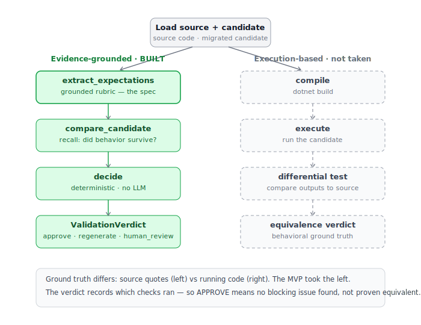

# lab6-agentic-migration-pipeline

Validates AI-generated code migrations between any source and target
environment (for example, Python to C#).

The focus is **validation**, not migration. Given a source and a candidate,
the pipeline extracts a source-grounded specification of the behavior that
must be preserved, then grades the candidate against it. It does not compile
or run the candidate — conclusions are static and evidence-grounded.

```
load source + candidate
  → extract_expectations   grounded rubric (the spec)
  → compare_candidate      findings: did behavior survive?
  → decide                 deterministic verdict, no LLM
  → ValidationVerdict       approve · regenerate · human_review
```



## Principles

- **Grounded** — every claim cites a verbatim source quote; ungrounded ones are dropped.
- **Bounded** — the LLM judges; deterministic code decides the verdict.
- **Fail-closed** — declines rather than guesses on failure or ambiguity.
- **Honest** — `APPROVE` means "no blocking issue in the checks run", not "proven equivalent".

## Limits

No compilation, execution, or differential testing. Candidate-side evidence
is trusted, not yet verified. Numeric-type differences (e.g. float vs decimal)
may pass unless the comparison prompt is tuned for them.

## Status

Built end to end on one source/candidate pair. Planned: unsupported-behavior
check, correction loop, seeded-mutation harness.

## Setup

```
pip install -r requirements.txt   # Python 3.12+
```

Fresh checkout: every package dir under `src/` needs `__init__.py`, and
Pydantic contract files must not use `from __future__ import annotations`.
