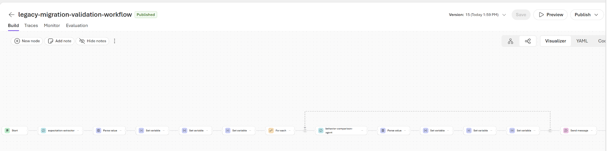

# Foundry Visual Workflow

This folder documents a proof of concept that reproduces the main flow of the migration-validation pipeline in the Microsoft Foundry visual workflow designer.
## Workflow overview



## POC idea

The goal is to show that the core validation flow can be built visually:

```text
input
→ extract expectations
→ parse structured output
→ loop through expectations
→ compare each expectation
→ update counters
→ return verdict
```

The workflow uses two Foundry agents:

- `expectation-extractor`
- `behavior-comparison-agent`

The final verdict is calculated with workflow variables and expressions:

```text
all preserved        → approve
changed or missing   → regenerate
unclear or unusable  → human_review
```

## What the POC demonstrates

- structured agent outputs
- sequential orchestration
- looping over expectations
- one comparison per expectation
- deterministic counters and verdict
- portal-visible traces for every step

## Limitations

This is not a full replacement for the Python pipeline.

It currently does not include:

- repeated extraction passes
- local source-evidence verification
- expectation deduplication and stable IDs
- complete aggregation of all comparison results
- an independent evaluation cross-check
- detailed final reports
- compile-time or runtime validation

The workflow must also remain stateless. Reusing the same conversation can allow earlier test input to affect later runs.

## Scope

The visual workflow is mainly a demonstration and learning artifact. The more complete implementation remains the hybrid Python pipeline, where complex validation logic is easier to test, version, and maintain.